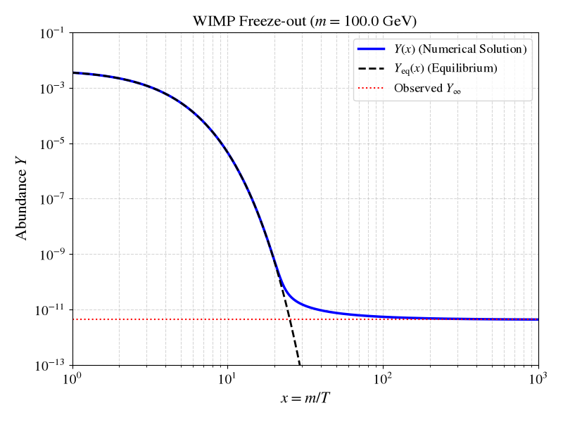

# WIMP

Solution of "[NeMO-C 2024: Dark Matter Tutorial](./tutorial.pdf), *Solving the Boltzmann Equation* by Nicolás Bernal

Solve the Boltzmann equation for the relic density calculation of Weakly Interacting Massive Particle (WIMP) dark matter

## Result

